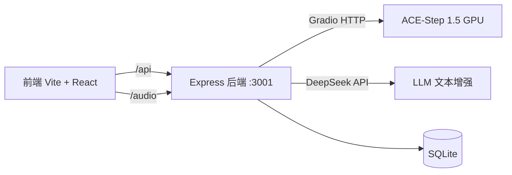

<p align="center">
  
</p>

<h1 align="center">ACE-Step UI</h1>

<p align="center">
  <strong>本地 AI 音乐生成器 · Fork 维护版</strong><br>
  <em>基于 <a href="https://github.com/ace-step/ACE-Step-1.5">ACE-Step 1.5</a> 的本地 AI 音乐生成前端 + 后端</em>
</p>

<p align="center">
  
  
  
</p>

---

## 📋 项目定位

**ACE-Step UI** 是一款本地 AI 音乐生成工具的前后端一体包。  
本项目为 [fspecii/ace-step-ui](https://github.com/fspecii/ace-step-ui) 的 Fork，专注于：

- **单实例本地部署** — 移除多用户系统，开箱即用
- **CLI 管理** — 面向 OpenClaw 的服务管理工具
- **DeepSeek API 集成** — 替代本地 LLM 进行文本增强
- **中文化** — 默认中文界面

## 🏗 架构



## 🚀 快速开始

### 前置条件

- Node.js ≥ 18
- ACE-Step 1.5 在本地运行（Gradio API）

### 安装

```bash
# npm 全局安装（推荐，三合一）
npm install -g ace-step-ui-cli ace-step-ui-server ace-step-ui-ui
ace-step-ui start --port 3001

# 或 Git 克隆
git clone https://github.com/kuaizhongqiang/ace-step-ui.git
cd ace-step-ui
npm install
cp .env.example .env
node server/cli.mjs dev
```

### 配置 `.env`

```env
PORT=3001                    # 后端端口
ACESTEP_API_URL=http://localhost:7860  # ACE-Step Gradio API
DEEPSEEK_API_KEY=sk-xxx      # DeepSeek API Key（可选）
```

### 启动

```bash
# 开发模式（前端 + 后端并行）
node server/cli.mjs dev

# 生产模式
npm run build
node server/cli.mjs start --port 3001
```

## 📖 CLI 命令

```bash
node server/cli.mjs help        # 帮助
node server/cli.mjs start       # 后台启动
node server/cli.mjs stop        # 停止
node server/cli.mjs status      # 运行状态
node server/cli.mjs health      # 健康检查
node server/cli.mjs logs -f     # 实时日志
node server/cli.mjs config      # 配置查看
node server/cli.mjs list styles # 列出风格
```

## 🗺 路由表

| 路径 | 说明 |
|------|------|
| `/api/songs` | 歌曲 CRUD |
| `/api/generate` | 音乐生成 |
| `/api/playlists` | 播放列表 |
| `/api/search` | 搜索 |
| `/api/contact` | 联系表单 |
| `/api/reference-tracks` | 参考音频 |
| `/audio/` | 音频文件 |
| `/editor` | 音频编辑器 (AudioMass) |
| `/demucs-web` | 人声分离 |
| `/health` | 健康检查 |

## 📦 数据库

SQLite (WAL 模式)，自动迁移。

主要表：`songs`, `playlists`, `playlist_songs`, `likes`, `comments`, `generation_jobs`, `reference_tracks`

## 🔧 开发

```bash
npm run dev            # Vite 前端 :3000
cd server && npx tsx src/index.ts  # 后端 :3001
npx tsc --noEmit       # 前端类型检查
cd server && npx tsc --noEmit  # 后端类型检查
```

## 📄 许可证

MIT · Copyright (c) 2026 [kuaizhongqiang](https://github.com/kuaizhongqiang) · 原仓库 [Ambsd](https://github.com/fspecii)
